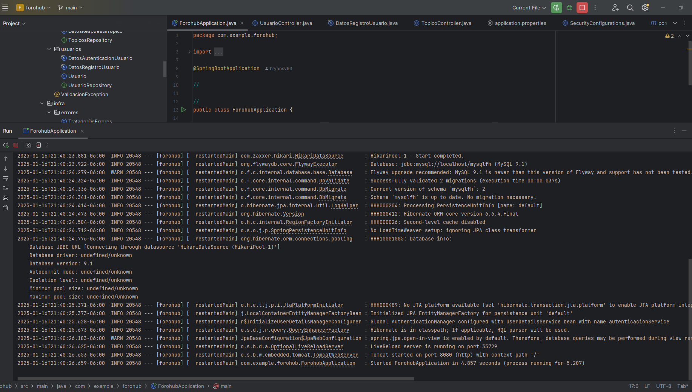
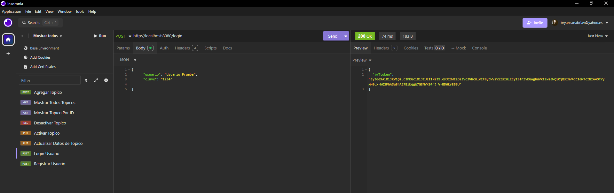
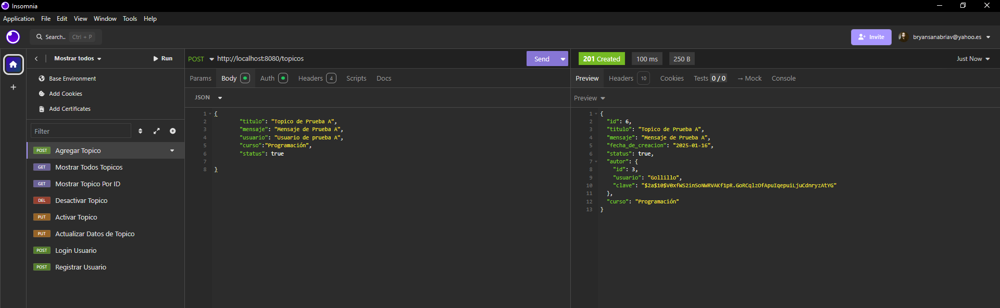
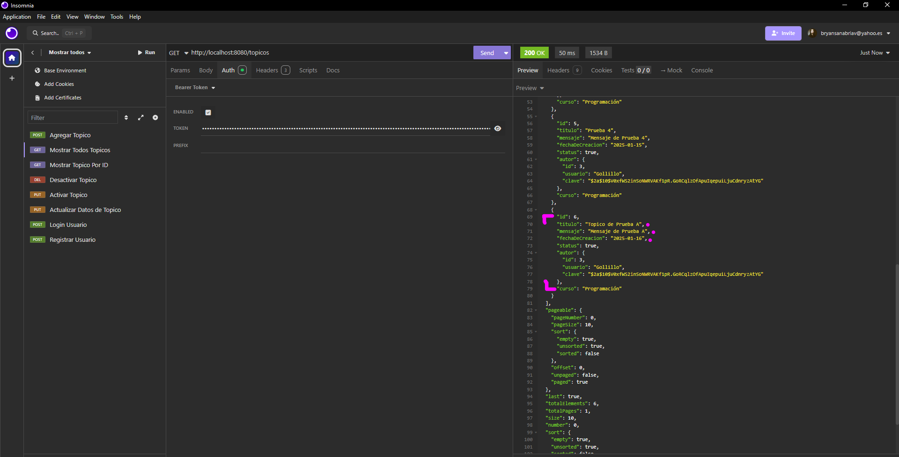
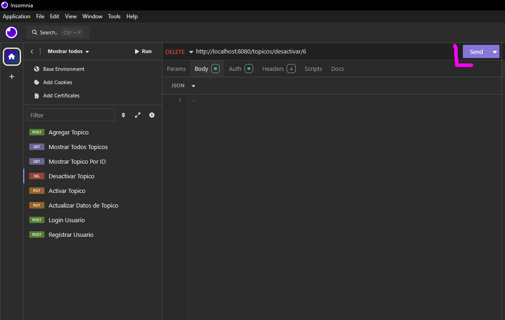
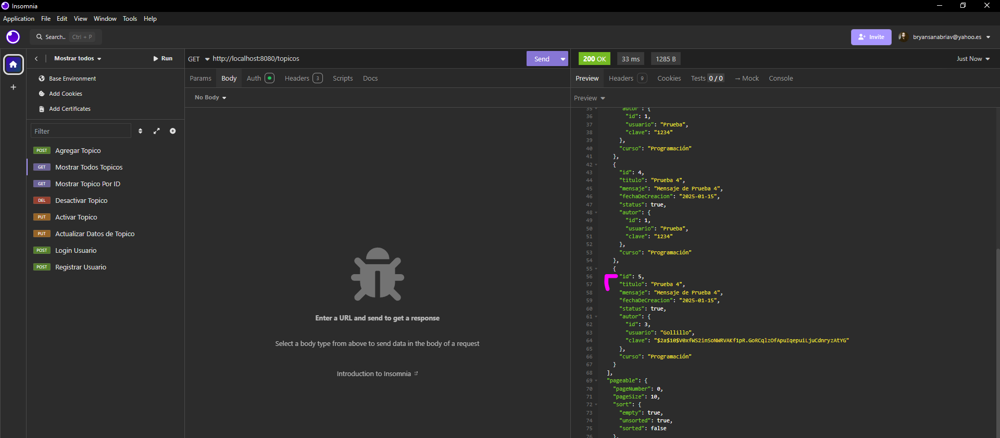
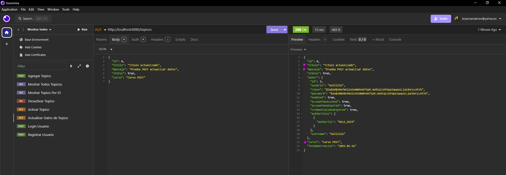
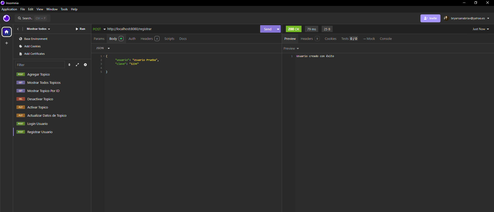

# Forohub  

---

## 📋 Índice  
1. [Descripción del Proyecto](#-descripción-del-proyecto)
2. [Configuracion del Proyecto](#-configuracion-del-proyecto)  
3. [Demostración de Funciones](#-demostración-de-funciones-y-aplicaciones)  
4. [Acceso al Proyecto](#-acceso-al-proyecto)  
5. [Tecnologías Utilizadas](#-tecnologías-utilizadas)  
6. [Personas Desarrolladoras del Proyecto](#-personas-desarrolladoras-del-proyecto)  

---

## 📝 Descripción del Proyecto  
**[Forohub]** Forohub es un proyecto basado en un entorno Backend el cual simula una plataforma de foros, donde se puede crear un usuario y publicar topicos de temas diferentes.

Por ejemplo:  
> "Crear mi usuario en Forohub para publicar un topico donde deseo solcitar ayuda para algún tema en especifico de un curso en especifico"

---

## 📝 Configuracion del Proyecto

- **Paso 1**: [Es necesario crear nuestro proyecto utilizando Spring Boot Framework, asi como las depedencias PostgreSQL, Spring Boot Security , Flywaymsql, Lombok ].  

- **Paso 2**: [Deben de configurarse las variables de entorno en su sistema operativo para en enlace a las bases de datos, las cuales están referenciadas en el proyecto en el archivo aplication.properties en:

spring.datasource.username={DB_USER}

spring.datasource.password={DB_PASSWORD}

].  
- **Paso 3**: [Para poder validar la funcionalidad de la aplicación, es necesario utilizar la aplicación Insomnia o en su defecto Postman con la URL de consultas.

]. 
---

## 🎥 Demostración de Funciones 
### Funciones Principales:  
- **Agregar Topico**: [Agrego un topico usando un POST con la siguiente URL http://localhost:8080/topicos].  
- **Mostrar Todos Topicos**: [Muestro todos los topicos usando un GET con la URL http://localhost:8080/topicos].  
- **Mostrar Topico Por ID**: [Muestro un topico especifico por ID con la siguiente ruta http://localhost:8080/topicos/mostrar/idDelTopico].
- **Desactivar Topico**: [Desactivo un topico especifico por ID usando un DELETE con la siguiente ruta http://localhost:8080/topicos/desactivar/idDelTopico].
- **Activar Topico**: [Activo un topico especifico por ID usando un PUT con la siguiente ruta http://localhost:8080/topicos/desactivar/idDelTopico].
- **Actualizar Datos de Topico**: [Actualizo la información del topico especificado por su ID los datos de de Titulo, Mensaje, Status, Curso, por medio del body en formato Json usando un PUT con la siguiente ruta http://localhost:8080/topicos].
- **Login Usuario**: [Logueo un usuario por medio del body Json usando un POST con la siguiente ruta http://localhost:8080/login.].
- **Registrar Usuario**: [Registro un usuario por medio de un body Json usando un POST con la siguiente ruta http://localhost:8080/registrar].

---

### Vista Previa:  
 

---

## 🚀 Acceso al Proyecto  
Puedes acceder al proyecto mediante:  
- **Repositorio en GitHub**: [Enlace al repositorio](https://github.com/Jonathan-FCH/forohub)  

---

## 🛠️ Tecnologías Utilizadas  
- **Backend**: Java versión 22, Spring Boot Framework 3.4.1 Maven, Biblioteca Gson 2.10.1, 
---

## 👨‍💻 Personas Desarrolladoras del Proyecto  
- **Jonathan Fonseca Chacon**  
   - [LinkedIn](linkedin.com/in/jonathan-fonseca-chacon)  
  - [GitHub](https://github.com/Jonathan-FCH)   

---